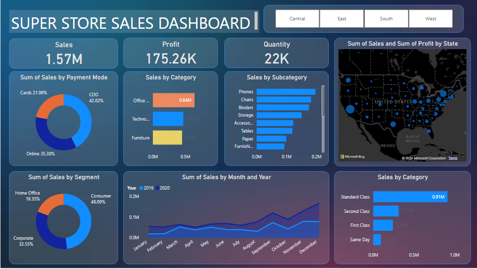

# Super Store Sales Dashboard - Power BI

## 📊 Project Overview
This project presents a **Power BI dashboard** designed to visualize and analyze sales data for a superstore. The dashboard provides actionable insights into sales, profit, and customer behavior to support data-driven decision-making.

## ✨ Key Features
- **Sales Summary**: Overview of total sales, profit, and order quantities.
- **Sales Trend Analysis**: Visualizing sales trends over time (monthly, quarterly, yearly).
- **Geographical Analysis**: Interactive maps displaying sales by regions, states, and cities.
- **Product Performance**: Breakdown of sales by product category and sub-category.
- **Customer Segmentation**: Insights into different customer segments and their buying patterns.
- **Top Performers**: Identification of best-selling products and most profitable regions.
- **Interactive Filters**: Filter by region, product category, customer segment, and time.

## 📁 Data Source
The dashboard uses the **Super Store Sales** dataset, which includes:
- **Sales Data**: Transactional records (sales, orders, returns).
- **Customer Data**: Details like customer region, segment, and demographics.
- **Product Data**: Information about product categories, sub-categories, and suppliers.

## 🛠️ Technologies Used
- **Power BI**: For data visualization and report building.
- **Excel/CSV**: To source the data for Power BI.

## 🖼️ Dashboard Screenshots
Below are snapshots of the key views from the dashboard:

### Dashboard-1


### Dashboard-2


## 🚀 Getting Started
Follow these steps to use the dashboard:

1. **Clone the repository**:
   ```bash
   git clone https://github.com/your-username/super-store-sales-dashboard.git
